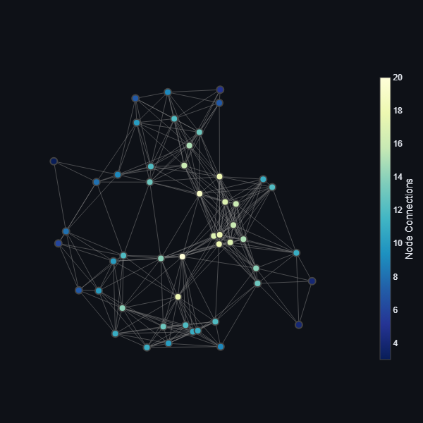

# Network Dynamics Simulation and Estimation

This project simulates and analyzes the dynamics of a discrete-time linear network autoregressive model. The goal is to study how the states of nodes in a network evolve over time under the influence of internal interactions, external inputs, and random noise. The project also estimates the influence matrix $\mathbf{A}$ from simulated data and compares it with the true matrix.

## Table of Contents
1. [Overview](#overview)
2. [Installation](#installation)
3. [Usage](#usage)
4. [Outputs](#outputs)
5. [Contributing](#contributing)


---

## Overview

The system is governed by the following equation:

$\mathbf{y}_t = \mathbf{A} \mathbf{y}_{t-1} + \mathbf{B} \mathbf{x}_t + \mathbf{\epsilon}_t$

where:
- $\mathbf{y}_t$: State vector of the network at time $t$.
- $\mathbf{A}$: Influence matrix encoding interactions between nodes.
- $\mathbf{B}$: External influence matrix encoding how external inputs affect nodes.
- $\mathbf{x}_t$: External input vector at time $t$.
- $\mathbf{\epsilon}_t$: Noise vector at time $t$.

The project generates synthetic data, simulates the network dynamics, estimates $\mathbf{A}$, and visualizes the results.

---

## Installation

To run this project, follow these steps:

1. Clone the repository:
   ```bash
   git clone https://github.com/HamidAbbasi-R/Network-Autoregressive-Model.git
   cd Network-Autoregressive-Model
   ```

2. Install the required dependencies:
   ```bash
   pip install -r requirements.txt
   ```

3. Run the Streamlit app:
   ```bash
   streamlit run main.py
   ```

---

## Usage

1. **Configure Parameters**:
   Use the sidebar in the Streamlit app to set parameters such as:
   - Number of nodes ($ N $)
   - Radius for the random geometric graph
   - Time vector (maximum time, number of time steps)
   - Maximum influence between connected nodes
   - Number of external inputs ($ P $)
   - Specifications for $ \mathbf{x}_t $ (e.g., sine wave or shock)
   - Lower and upper bounds for initial conditions
   - Minimum and maximum values for $ \mathbf{B} $
   - Mean and standard deviation for noise ($ \mathbf{\epsilon}_t $)

2. **Generate and Estimate**:
   Click the "Submit" button to generate the network, simulate the dynamics, and estimate $ \hat{\mathbf{A}} $.

3. **Analyze Results**:
   View the outputs, including plots of the network, matrices, time series, and external inputs.

---

## Outputs

The project produces the following outputs:

1. **Network Graph**:
   Visualization of the random geometric graph representing the network structure.

   

2. **Matrices Comparison**:
   Side-by-side comparison of the true influence matrix $ \mathbf{A} $ and the estimated matrix $ \hat{\mathbf{A}} $.

   

3. **Time Series**:
   Plots of the state vectors ($ \mathbf{y}_t $) over time for each node.

   

4. **External Inputs ($ \mathbf{x}_t $)**:
   Plot of the external inputs over time (e.g., sine wave or shock).

   
   


---

## Contributing

Contributions are welcome! To contribute to this project:

1. Fork the repository.
2. Create a new branch for your feature or bug fix.
3. Submit a pull request with a detailed description of your changes.
